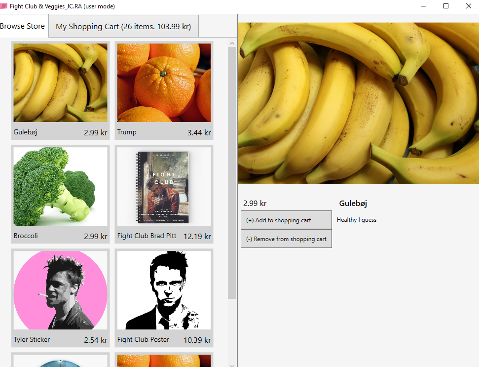
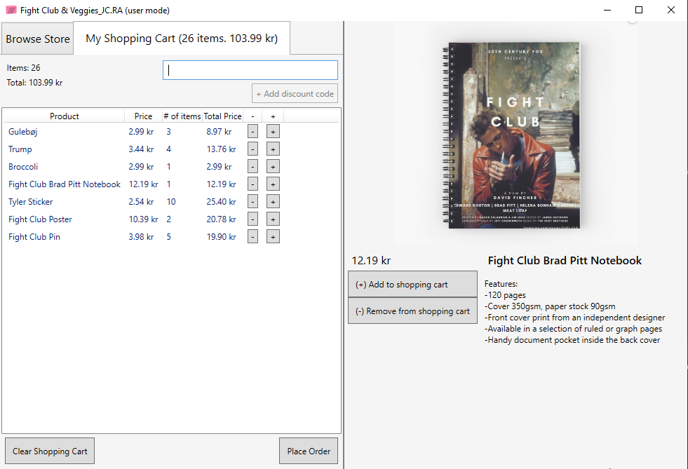
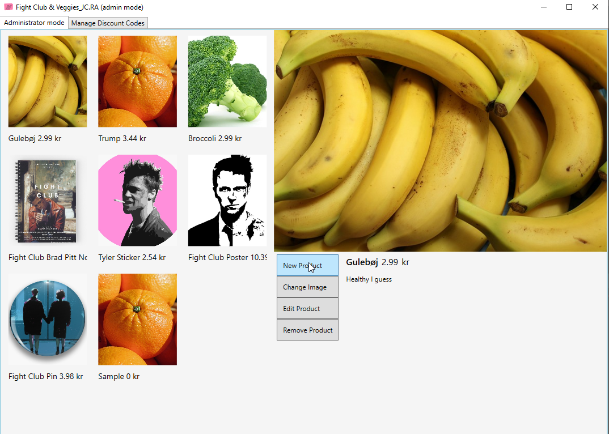
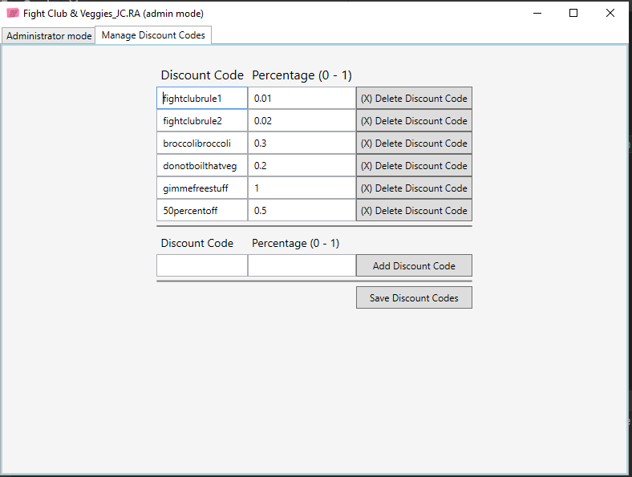

# PGBSNH20-Projektarbete-Butik

## Introduction

> This WPF project is the exam project in C# Fundamentals, the first course in our vocational studies to .NET Developer at Teknik Högskolan in Gothenburg, Sweden. The course was 13 weeks and mostly of practical project like content.

Developed by:

Johan Charlez -> [Github profile](https://github.com/johancz)

Robin Axelsson -> [Github profile](https://github.com/RobinAxelsson)

---
## Customer GUI

## Admin GUI

